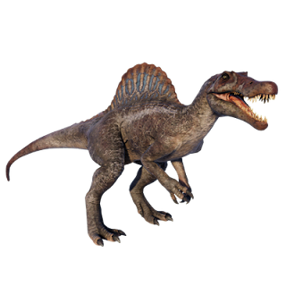

Šahovska rokada, 150 hiljada ljudi u Sremskoj Mitrovici ili rasprodani svi trikovi? Iskustva iz Kragujevca, gde je bio protest, pokazuju da jedini počinje da gubi na domaćem terenu. I da li su svi delići slagalice došli na svoje mesto?  Tu tezu počinje da dokazuje i to da je Zvezda karo i pik na Skočka (Miloš Vučević) ipak bila dobitna kombinacija, jer se u Sremskoj Mitrovici, nije pojavio bivšosadašnji premijer, već je bio u Orašcu. Jasno je valjda ko je zvezda u ovoj igri...

Međutim, ajmo redom. Na Sretenje su bila tri ključna događaja: protest studenata i građana u Kragujevcu, istorijskom domu Sretenjskog ustava, proslava dana državnosti u Orašcu, kao i kontraprotest protiv nevidljive borbe za nezavisnost Vojvodine. U Kragujevcu se, logično, niko nije pojavio iz državnog vrha (osim Danice Grujičić, ali to je malo wtf momenat), u Orašcu, daleko od rodnog Novog Sada je bio Miloš Vučević, a na kontraprotestu su bili oni najbliži jedinom. Kada se sve kockice slože, izgleda da su jedini preživeli Ana Brnabić i Dragan J Vučićević.

Upravo me lagano izumiranje vraća na originalnu inspiraciju za ovaj tekst, Spinosaurus. Naime, to je zapravo prava vrsta [dinosaurusa](https://en.wikipedia.org/wiki/Spinosaurus), koja je izumrla pre jedno sto miliona godina. Veruje se da je to bio najveći mesožder na svetu, a ono što je karakteristično za spinosaurusa je njegov veliki ekstremitet na leđima (gledaj sliku) za koji se veruje da je imao svrhu šepurenja. Veliki ekstremitet (stručni naziv je gastralija, to niko ne zna šta je) na leđima bi u svrhu privlačenja partnera ili opasnosti menjao boju i tako se prikazivao drugačije.

***

***

Liči li vam to na nekoga? Osim što ima nešto i u nauci o imenima, danas vidimo da je Vojvodina ta koja je morala da promeni boju u opasnosti. Međutim, pored kontramitinga, u Kragujevcu su se pored želje za poštovanjem ustavnosti, pojavili i veliki crveni uzvičnici za jedinog. Upravo su emocije i empatija koja je, deluje, preplavila taj protest možda najveći signal opasnosti, jer su studenti dokazali da u ovoj tesnoj partiji pokera, imaju par Kraljeva, odnosno par Kragujevaca u ruci. U ovoj situaciji deluje da nam samo vreme može reći koliko su moćni asovi Brnabićka i DJV, a Vučević se za sada ipak vratio u rukav. 

Iako su emocije veliki deo svih populističkih lidera, a prema svim udžbenicima u tu kategoriju spada i jedini, u ovoj situaciji deluje da počinje da gubi na domaćem terenu. Pravo akademsko istraživanje se sprovodi pred našim očima, a čak će i umetnici izvući pouke iz ove izuzetno kompleksne društveno-političke krize. Jer ova situacija deluje da će prevashodno odgovoriti na pitanje koja je jača emocija, strah ili ljubav?